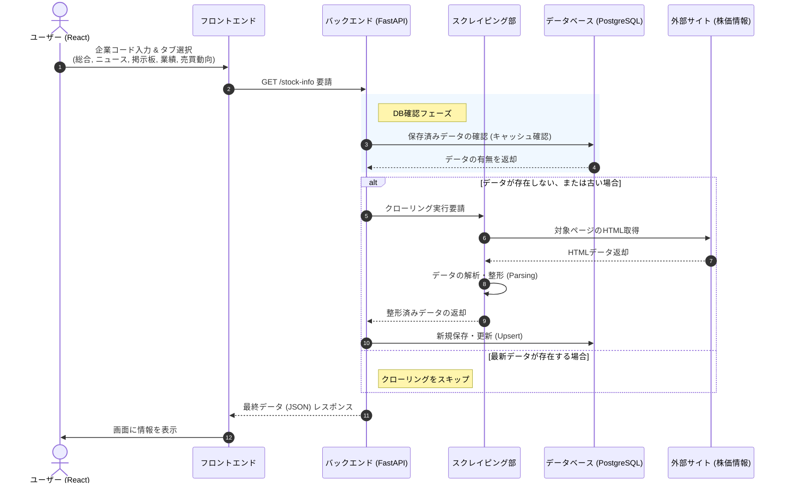

# 📈 Naver Stock Crawler Project
>NAVER証券(Finance)のデータをクローリングし、リアルタイムの株価情報を提供するフルスタックWebアプリケーションです。
FastAPI(Backend)、React(Frontend)、PostgreSQL(Database)を活用し、データの抽出から保存、可視化までの全工程を構築しました。
---

## 📝 プロジェクト概要
- **目的**: NAVER証券のリアルタイムデータを収集し、DBに蓄積することで、ユーザーにダッシュボード形式のデータを提供
- **主な機能**:
  - NAVER証券のリアルタイム人気銘柄および指数のクローリング (BeautifulSoup4)
  - 収集データのPostgreSQLによる履歴管理と保存
  - FastAPI を利用した効率的な非同期APIサーバーの構築
  - React を用いた直感的な株価ダッシュボードのUI実装

---
## 🔧Environment
- **OS**: Windows11
- **Python**: 3.11.9
- **Node.js**: 24.12.0
- **FastAPI**: 0.128.0
- **PostgreSQL**: 18.1
- **React**: 19.2.3
---
## 💻システムアーキテクチャ

|段階|説明|
|---|---|
|リクエスト|Reactから企業コードと閲覧タイプを送信|
|データ検証|DB内の既存データの有無と更新日時を確認|
|スクレイピング|(データがない場合) 外部サイトから情報を取得|
|保存|取得したデータをPostgreSQLに保存 (キャッシュ)|
|表示|最終データをレスポンスし、画面に表示|
## 🛠 技術スタック

### [Backend]
- **Language**: Python 
- **Framework**: FastAPI
- **Library**: BeautifulSoup4, Requests, SQLAlchemy (ORM)
- **Database**: PostgreSQL 

### [Frontend]
- **Library**: React, Axios
- **Styling**: CSS (Styled-components)
- **State Management**: React Hooks (useState, useEffect)

---

## 🗄 データベース設計 (ERD)
収集された株式データは、PostgreSQLに次のような構造で保存されます。

- **Table: `stock`**
  - `code`: 銘柄コード
  - `sell_rank`: 売員上位ランク
  - `sell_volume`: 売り数量
  - `buy_rank`: 買い上位ランク
  - `buy_volume`: 買い数量 

- **Table: `frgn`**
  - `code`: 銘柄コード
  - `date`: 日付 
  - `close_price`: 終値 
  - `change_val`: 前日比(値) 
  - `change`: 騰落率 
  - `change_rate` : 騰落率
  - `volume` : 出来高
  - `insstitution_net_volume` : 機関純売買量
  - `foreign_net_volume` :外国人純売買量
  - `foreign_holding_shares`:外国人保有株数
  - `foreign_holding_radio`:外国人保有率
 
- **Table: `news`**
  - `code`: 銘柄コード 
  - `date`: 日付
  - `title`: タイトル 
  - `content`: 內容 
 
- **Table: `board`**
  - `code`: 銘柄コード 
  - `date`: 日付 
  - `title`: タイトル 
  - `content`: 內容 

- **Table: `summary`**
  - `code`: 銘柄コード
  - `date`: 日付 
  - `revenue`: 売上高 
  - `operating_income`: 営業利益
  - `net_income`: 当期純利益 
  - `operating_margin`: 営業利益率 
  - `net_profit_margin`: 純利益率 
  - `roe`: ROE
  - `debt_to_equity`: 負債比率
  - `quick_ratio`: 当座比率 
  - `reserve_ratio`: 留保率
  - `eps`: EPS
  - `per`: PER
  - `bps`: BPS
  - `pbr`: PBR
  - `dps`: 配当利回り 
  - `dividend_yield`: 配当利回り
  - `payout_ratio`: 配当性向 
  - `type` : 区分


## 📂 Directory: ディレクトリ構造
```project
pycrawling
┃
┃frontend
┃┗src
┃ ┣ component
┃ ┃ ┣ css
┃ ┃ ┃ ┗ font.css
┃ ┃ ┣ RowRender.jsx
┃ ┃ ┗ tabpage.jsx
┃ ┣ App.css
┃ ┣ Dockerfile
┃ ┣ App.jsx
┃ ┣ index.css
┃  ┣ index.css
┃ ┗ main.jsx
┃ backend
┃ ┣ routers
┃ ┃ ┣ board.py
┃ ┃ ┣ frgn.py
┃ ┃ ┣ news.py
┃ ┃ ┣ stock.py
┃ ┃ ┗ summary.py
┃ ┃
┃ ┣ Dockerfile
┃ ┣ requirements.txt
┃ ┣ database.py
┃ ┗ main.py
┃
┗ docker-compose
```


## 📊 実行結果


## ⚙️開始方法
### 1. 準備：プログラムのダウンロード

まずは、インターネット上にあるプログラムの設計図（ソースコード）を自分のパソコンに持ってきます。

- *ターミナル（Mac）またはコマンドプロンプト（Windows）**を開いて、以下のコマンドを順番に打ち込みます。

```bash
# 1. 作業したいフォルダに移動します（例：デスクトップなど）
# cd は "Change Directory（場所移動）" の略です
cd Desktop  

# 2. プログラムをコピーしてダウンロードします
git clone https://github.com/wangjh24/pyCrawling.git 

# 3. 作られたフォルダの中に入ります
cd pyCrawling
```

---

### 2. バックエンド（頭脳部分）の設定

ここでは、データを処理するバックエンド（サーバー）を用意します。

```bash

# 1. バックエンド用のフォルダに移動します
cd backend

# 2. 「仮想環境」を作ります
# パソコン全体を汚さないよう、このプロジェクト専用の小部屋（venv）を作るイメージです
python -m venv venv

# 3. その小部屋に入ります（活性化）
# 【Mac/Linuxの方】
source venv/bin/activate  
# 【Windowsの方】
# venv\Scripts\activate

# 4. 必要な道具（ライブラリ）を一括でインストールします
# pip は Python の道具箱のようなものです
pip install -r requirements.txt

# 5. サーバーを起動します！
# これで裏側のプログラムが動き出します
uvicorn main:app --reload
```


---

### 3. フロントエンド（見た目部分）の設定

次に、ブラウザで操作するためのプロントエンドを準備します。

```bash
# 1. (新しいウィンドウで) プロジェクトの最初のフォルダに戻り、frontendに移動します
cd pyCrawling/frontend

# 2. 画面を作るための部品をダウンロードします
# npm は JavaScript の道具箱です。少し時間がかかる場合があります
npm install  

# 3. 画面を起動します！
npm run dev
```

---

### 4. 実際に使ってみる

全ての準備が整いました！

1. `npm run dev` を実行した後に表示される URL（例：`http://localhost:5173` など）をコピーします。
2. Google Chrome などのブラウザに貼り付けて開きます。
3. 画面が表示されたら成功です！
 
