# 📈 Naver Stock Crawler Project
>NAVER証券(Finance)のデータをクローリングし、リアルタイムの株価情報を提供するフルスタックWebアプリケーションです。
FastAPI(Backend)、React(Frontend)、PostgreSQL(Database)を活用し、データの抽出から保存、可視化までの全工程を構築しました。
---

## 📝 プロジェクト概要
- **目的**: NAVER証券のリアルタイムデータを収集し、DBに蓄積することで、ユーザーにダッシュボード形式のデータを提供
- **主な機能**:
  - NAVER証券のリアルタイム人気銘柄および指数のクローリング (BeautifulSoup4)
  - 収集データのPostgreSQLによる履歴管理と保存
  - FastAPI を利用した効率的な非同期APIサーバーの構築
  - React を用いた直感的な株価ダッシュボードのUI実装

---
## 🔧Environment
- **OS**: Windows11
- **Python**: 3.11.9
- **Node.js**: 24.12.0
- **FastAPI**: 0.128.0
- **PostgreSQL**: 18.1
- **React**: 19.2.3
---
## 💻システムアーキテクチャ

```mermaid
 sequenceDiagram
    autonumber
    actor User as ユーザー (React)
    participant Frontend as フロントエンド
    participant Backend as バックエンド (FastAPI)
    participant Scraper as スクレイピング部
    participant DB as データベース (PostgreSQL)
    participant Web as 外部サイト (株価情報)

    User->>Frontend: 企業コード入力 & タブ選択<br/>(総合, ニュース, 掲示板, 業績, 売買動向)
    Frontend->>Backend: GET /stock-info 요청

    rect rgb(240, 248, 255)
    note right of Backend: DB確認フェーズ
    Backend->>DB: 保存済みデータの確認 (キャッシュ確認)
    DB-->>Backend: データの有無を返却
    end

    alt データが存在しない、または古い場合
        Backend->>Scraper: クローリング実行要請
        Scraper->>Web: 対象ページのHTML取得
        Web-->>Scraper: HTMLデータ返却
        Scraper->>Scraper: データの解析・整形 (Parsing)
        Scraper-->>Backend: 整形済みデータの返却
        Backend->>DB: 新規保存・更新 (Upsert)
    else 最新データが存在する場合
        note right of Backend: クローリングをスキップ
    end

    Backend-->>Frontend: 最終データ (JSON) レスポンス
    Frontend->>User: 画面に情報を表示
```

## 🛠 技術スタック

### [Backend]
- **Language**: Python 
- **Framework**: FastAPI
- **Library**: BeautifulSoup4, Requests, SQLAlchemy (ORM)
- **Database**: PostgreSQL 

### [Frontend]
- **Library**: React, Axios
- **Styling**: CSS (Styled-components)
- **State Management**: React Hooks (useState, useEffect)

---

## 🗄 データベース設計 (ERD)
収集された株式データは、PostgreSQLに次のような構造で保存されます。

- **Table: `stock`**
  - `code`: 銘柄コード
  - `sell_rank`: 売員上位ランク
  - `sell_volume`: 売り数量
  - `buy_rank`: 買い上位ランク
  - `buy_volume`: 買い数量 

- **Table: `frgn`**
  - `code`: 銘柄コード
  - `date`: 日付 
  - `close_price`: 終値 
  - `change_val`: 前日比(値) 
  - `change`: 騰落率 
  - `change_rate` : 騰落率
  - `volume` : 出来高
  - `insstitution_net_volume` : 機関純売買量
  - `foreign_net_volume` :外国人純売買量
  - `foreign_holding_shares`:外国人保有株数
  - `foreign_holding_radio`:外国人保有率
 
- **Table: `news`**
  - `code`: 銘柄コード 
  - `date`: 日付
  - `title`: タイトル 
  - `content`: 內容 
 
- **Table: `board`**
  - `code`: 銘柄コード 
  - `date`: 日付 
  - `title`: タイトル 
  - `content`: 內容 

- **Table: `summary`**
  - `code`: 銘柄コード
  - `date`: 日付 
  - `revenue`: 売上高 
  - `operating_income`: 営業利益
  - `net_income`: 当期純利益 
  - `operating_margin`: 営業利益率 
  - `net_profit_margin`: 純利益率 
  - `roe`: ROE
  - `debt_to_equity`: 負債比率
  - `quick_ratio`: 当座比率 
  - `reserve_ratio`: 留保率
  - `eps`: EPS
  - `per`: PER
  - `bps`: BPS
  - `pbr`: PBR
  - `dps`: 配当利回り 
  - `dividend_yield`: 配当利回り
  - `payout_ratio`: 配当性向 
  - `type` : 区分


## 📂 Directory: ディレクトリ構造
```project
frontend
┗src
 ┣ component
 ┃ ┣ css
 ┃ ┃ ┗ font.css
 ┃ ┣ RowRender.jsx
 ┃ ┗ tabpage.jsx
 ┣ App.css
 ┣ App.jsx
 ┣ index.css
 ┗ main.jsx
backend
 ┣ routers
 ┃ ┣ board.py
 ┃ ┣ frgn.py
 ┃ ┣ news.py
 ┃ ┣ stock.py
 ┃ ┗ summary.py
 ┣ database.py
 ┗ main.py

```


## 📊 実行結果

## ⚙️開始方法
```
cd [folder name] #or mkdir [folder name]

git clone https://github.com/wangjh24/pyCrawling.git 
```

**backend**
```
cd backend

# 仮想環境の生成と活性化
python -m venv venv
source venv/bin/activate  # Windows: venv\Scripts\activate

# 依存性設置
pip install -r requirements.txt

# サーバー実行
uvicorn main:app --reload
```

**frontend**
```
cd .. frontend

# パッケージ·インストール
npm install  

# 実行
npm run dev #npm start
```

 
